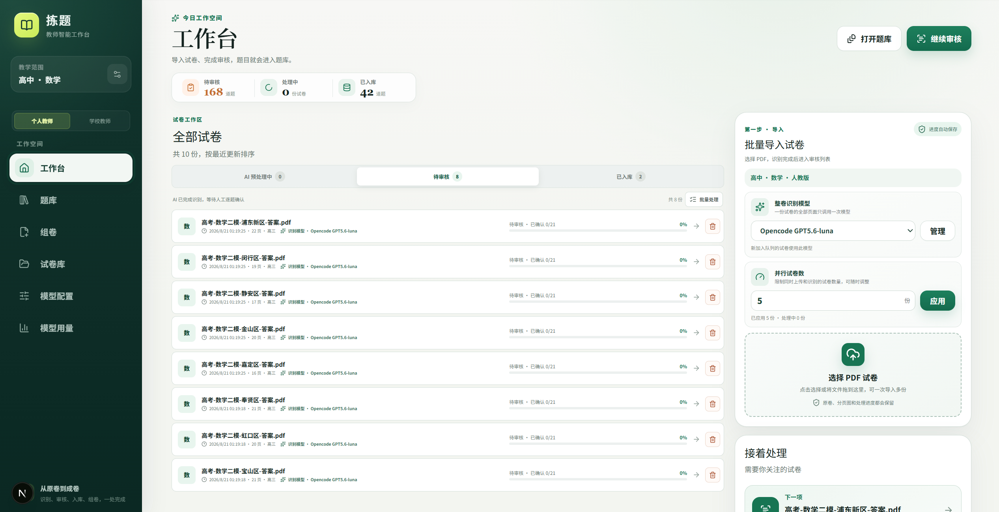
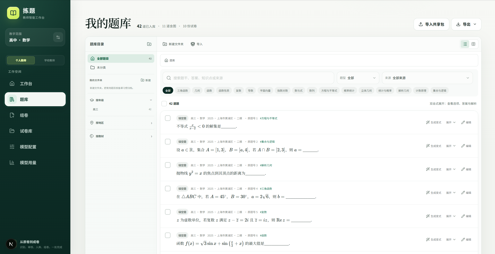
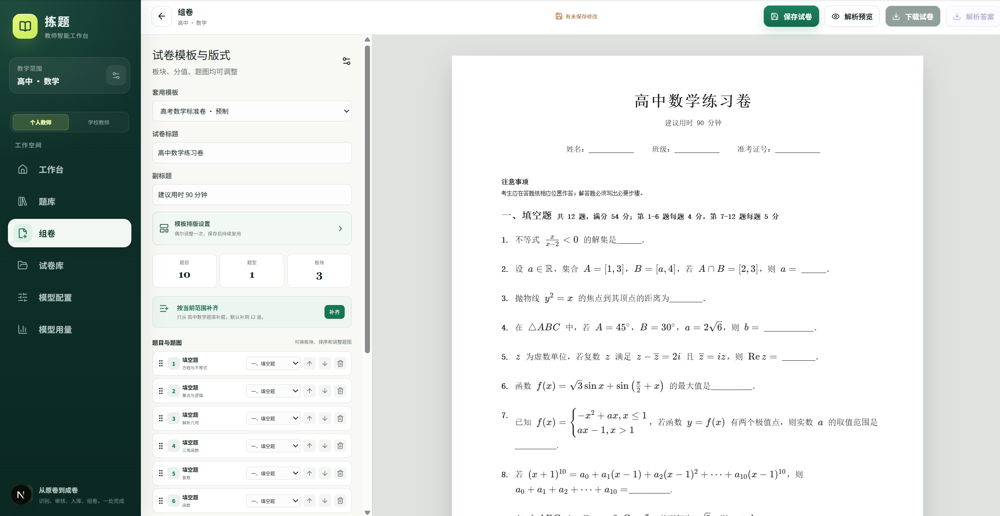
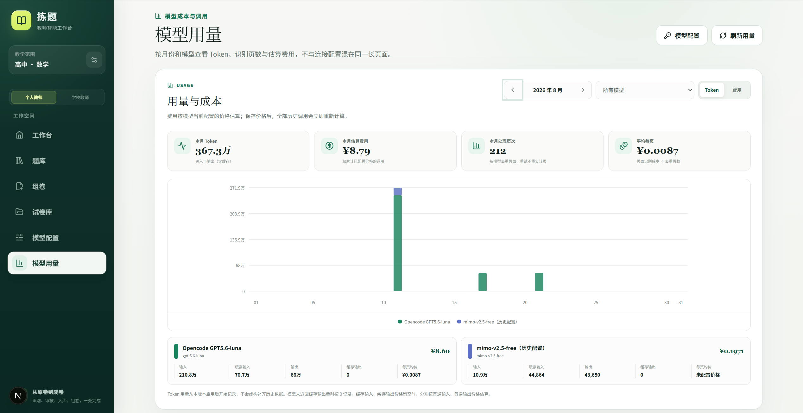

<div align="center">

# 拣题 · 教师题库助手

**把散落在 PDF 试卷里的题目，变成可检索、可复用、可组卷的个人题库。**

本地优先 · AI 识题 · 人工复核 · 智能组卷 · 数据可控


[快速开始](#快速开始) · [真实使用场景](#真实使用场景) · [功能亮点](#功能亮点) · [数据与安全](#数据与安全) · [完整功能清单](docs/features.md)

</div>

---

## 为什么做「拣题」

老师手里通常有很多试卷，但“有资料”不等于“有题库”：题目散落在 PDF 中，搜索困难，重复使用时还要截图、抄题、重新排版。

拣题把这条流程串成一个本地工作台：

```text
导入 PDF → AI 识别整卷 → 对照原卷审核 → 题目入库 → 检索/生成变式 → 组卷 → 导出 PDF
```

原卷、页面图、题图、题库和模型配置都保存在本机。AI 负责减少机械劳动，最终入库仍由老师确认。

## 功能亮点

| 能力 | 说明 |
| --- | --- |
| 📚 批量导入 | 一次导入多份 PDF，逐页高清渲染，支持暂停、恢复、并发处理和失败重试 |
| 🧩 教学 Skills | 比较 12 个年级、10 个学科的默认规则；上传试卷图片生成个人 Skill，经试识别、模型和人工复核后启用 |
| ✨ 整卷识题 | 在全卷上下文中提取题干、LaTeX 公式、选项、答案、解析、标签与题图信息 |
| ✅ 对照审核 | 在原卷旁修改题目内容、题型、分值和标签，手工框选跨页题目及题图范围 |
| 🗂️ 题库管理 | 全文搜索、知识点/题型/来源筛选、多层文件夹、智能目录与批量移动 |
| 🪄 变式生成 | 基于已复核原题生成可追溯候选题，经规则与独立审校后再由老师决定是否入库 |
| 📝 智能组卷 | 从题库选题或补齐到目标分值，调整板块、顺序、分值和版式，实时预览 A4 试卷 |
| 📦 分享迁移 | 用单个 `.jianti` 文件导入/导出题目、目录、标签、来源和题图 |
| 📊 成本可见 | 按月份和模型统计 Token、处理页数与估算费用，模型价格变化后可重新计算 |
| 🔒 本地优先 | SQLite 与文件资源均在本机；API Key 加密保存，接口不会回传明文 |

## 真实使用场景

以下均为项目真实运行界面。

### 1. 批量导入试卷，统一查看处理进度

工作台集中展示待处理、处理中和已入库试卷。选择学段、学科与识别模型后，可批量拖入 PDF，并按设备和模型限额调整并发数。



### 2. 把审核后的题目沉淀为可检索题库

题目可按文件夹、年级、地区和教材版本浏览，也可按题干、答案、知识点、题型或来源搜索。支持列表/平铺视图、批量移动和共享包导入导出。



### 3. 从题库选题并实时预览成卷效果

组卷时可套用模板、调整标题与板块、拖拽题目顺序、修改分值，并在右侧实时查看 A4 排版。保存后可分别导出学生试卷和解析答案。



### 4. 追踪模型 Token 与估算成本

模型用量页按月份和模型汇总输入、缓存输入、输出、处理页数及费用，方便评估不同模型的实际成本。



## 快速开始

### 环境要求

- Node.js `22.13+`（项目要求 Node.js 22）
- npm
- Chrome、Edge 或 Chromium（用于服务端生成 PDF；常见安装位置会自动检测）
- 一个支持图片输入的模型 API（可在启动后配置）

### Windows 一键启动

双击项目根目录的 `启动题库.cmd`。首次运行会自动安装依赖和生产构建，NestJS、Worker、网页全部就绪后打开浏览器。后续源码未变会复用构建。

停止服务可双击 `关闭题库.cmd`。

### 命令行启动

```bash
npm install
npm run local
```

打开 <http://localhost:3050>。

生产模式：

```bash
npm run build
npm start
```

默认网页端口 `3050`、NestJS `3051`；可通过环境变量或 `--web-port=... --api-port=...` 修改。开发热更新使用 `npm run dev`。

启用 FastAPI 后台 PDF 分页（首次需要 Python 3.11+ 与网络）：

```bash
npm run local:python
```

默认模式保留浏览器 PDF.js 分页，只需 Node.js。Python 模式下原卷上传后后台继续渲染，关闭网页也不会中断。运行架构、错误契约、远端登录及 PostgreSQL 迁移边界见 [架构说明](docs/architecture.md)。

## 首次使用

1. 打开左侧「模型配置」，新增识题模型。
2. 填写协议、API Base URL、模型名称和 API Key，并执行连接测试。
3. 回到「工作台」，选择学段、学科、模型和并发数。
4. 上传 PDF；识别完成后进入审核页逐题确认。
5. 完成审核，题目进入题库，即可检索、生成变式或用于组卷。

未配置模型时也可以上传原卷并生成分页图，任务会停在“等待模型配置”；配置完成后可直接重试，不需要重新上传。

### 支持的模型协议

- OpenAI Chat Completions
- OpenAI Responses
- Anthropic Messages

项目不内置模型、API 地址或公共凭据。可连接符合上述协议并支持图片输入的服务。自定义 Base URL 必须使用 HTTPS，仅 `localhost`、`127.0.0.1` 和 `::1` 允许 HTTP。

## 核心工作流

### 导入与识别

- 仅接收 PDF，避免 DOC/DOCX 在不同排版引擎中出现公式、字体或浮动对象错位。
- 默认浏览器使用 PDF.js 逐页高清渲染；可选 FastAPI 后台分页。原卷和页面图会立即保存。
- 每份试卷在整卷上下文中识别，题目、答案和解析一次关联并以事务写入数据库。
- 任务状态、重试次数和处理模型都会持久化，服务重启后可以续跑。

### 审核与入库

- 对照原卷修改题号、题型、题干、选项、答案、解析、分值和标签。
- 对跨页题目切换来源页，并手工框选题目范围、题图或答案图。
- 调整范围后生成真实 JPEG 裁剪图；答案图不会进入学生试卷。
- 只有确认完成的题目才进入正式题库。

### 检索、变式与共享

- 支持题干、答案、标签和来源全文检索，以及题型、来源、知识点筛选。
- 自定义多层文件夹，并按年级、地区、教材版本浏览智能目录。
- 变式题先进入候选区，展示规则检查、审校分数与修订记录；老师采用后才正式入库。
- 可导出 JSON、Markdown 或包含题图的 `.jianti` 单文件共享包。

### 个人教学 Skills

在左侧「教学 Skills」选择具体年级与学科，可并排比较默认 Markdown 规则，展开正式识题的完整共同输出协议，并导出 `SKILL.md`。

1. 上传一张 PNG、JPEG 或 WebP 试卷图片（最多 12MB），让模型生成个人草稿。
2. 修改规则并保存，点击「用当前版本试识别并复核」。原图、识别题目、模型疑点并排显示。
3. 对照原图人工通过或退回；可点击「根据模型与人工意见改进 Skill」，生成新版本后重新验证。
4. 人工通过后点击「启用已复核版本」。每位教师、每个年级学科同时只启用一个版本。
5. 在导入工作台明确选择本批年级。整卷识题、单题重识别、答案补录、题图复核及变式生成会采用匹配规则。

修改会停用个人版本；再次试识别完成后也需要重新人工确认。Skill、试识别版本、复核意见和正式识题使用快照均保存在本地数据库，样例图保存在本地文件区。试识别是图片转录实验，不会直接把测试题写入正式题库。模型调用仍使用你选择的模型服务。

### 组卷与输出

- 从题库选题，或在当前教学范围内智能补齐到目标分值。
- 内置中考数学、高考数学、日常作业和课堂测试模板。
- 可调整题目顺序、板块、分值、注意事项、考生信息栏和题图位置。
- 保存后分别下载学生试卷与解析答案 PDF。

## 数据与安全

默认数据位于项目根目录的 `data/`：

```text
data/
├── teacher-question-bank.sqlite3   # 题库与业务数据
├── files/                          # 原卷、页面图与裁剪图
└── .model-key-secret               # 本机生成的模型密钥加密材料
```

- SQLite 启用 WAL、外键、忙等待和原子事务。
- API Key 使用 AES-GCM 加密后存入 SQLite，浏览器接口只返回脱敏值。
- 可通过 `JIANTI_DATA_DIR` 把数据目录放到其他磁盘或 NAS。
- 生产环境建议复制 `.env.example` 并设置固定的 `MODEL_KEY_ENCRYPTION_SECRET`。
- 整个 `data/` 目录都应备份，但不要提交到 Git。

本地模式默认是单教师 `local-demo` 空间。如部署成公网多用户服务，必须由可信反向代理提供用户身份，不能允许客户端自行伪造身份请求头。

## 诊断、备份与恢复

检查 Node.js、数据库、数据目录和浏览器环境：

```bash
npm run doctor
```

创建并立即校验备份：

```bash
npm run backup
```

指定备份目录或复验已有备份：

```bash
npm run backup -- D:\\teacher-db-backups\\backup-2026-08-03
npm run backup:verify -- D:\\teacher-db-backups\\backup-2026-08-03
```

恢复前必须停止应用。恢复过程会把原数据目录保留为 `data.pre-restore-*` 安全副本：

```bash
npm run restore -- D:\\teacher-db-backups\\backup-2026-08-03 --confirm
```

## 常用命令

审核页的“AI 复核本题图片”会从原页像素生成候选框，再让当前所选模型判断题号归属和题图/答案图用途。模型不再估算裁剪坐标；结果先显示预览，应用到草稿并保存后才会写入题库。无法可靠定位的图片仍需手动补框。首次整卷识别不会自动调用这项复核。

图片定位的批量实测与隔离工作流验证（会调用已配置的 DeepSeek API 并产生用量）：

```bash
# 需要本地保留测试样本对应的原卷；输出位于 tmp/asset-benchmark
node --experimental-strip-types scripts/benchmark-asset-localization.mjs
# 先构建，再在数据副本中重新识别崇明、黄浦两卷，逐题复核并验证保存与裁剪读取
npm run build
node scripts/verify-asset-review-workflow.mjs
```

测试数据库、原页、API 密钥和模型响应均保留在被 Git 忽略的本地目录，不随代码上传。

| 命令 | 用途 |
| --- | --- |
| `npm run dev` | 启动开发服务器（端口 3050） |
| `npm run build` | 创建生产构建 |
| `npm start` | 启动生产服务器（端口 3050） |
| `npm test` | 运行自动化测试 |
| `npm run lint` | 运行 ESLint |
| `npm run doctor` | 检查本地运行环境 |
| `npm run backup` | 创建并校验数据备份 |
| `npm run backup:verify` | 复验已有备份 |
| `npm run restore` | 从备份恢复数据 |

## 技术栈

- Next.js 16、React 19、TypeScript 5
- Tailwind CSS 4、KaTeX
- SQLite、better-sqlite3、Drizzle ORM
- PDF.js、Sharp、Chrome / Edge / Chromium
- Node.js 22

项目不依赖 Cloudflare Sites、D1、R2、Vinext 或 Miniflare，可运行于 Windows、Linux、macOS、NAS 或普通 VPS。

## 项目结构

```text
app/          Next.js 页面与 API 路由
components/   工作台、审核、题库、组卷等界面组件
db/           Drizzle Schema 与数据库初始化
drizzle/      版本化 SQL 迁移
lib/          识别、队列、题库、组卷、备份等核心逻辑
scripts/      诊断、备份、恢复与验证脚本
tests/        Node.js 自动化测试
docs/         功能清单、代码审查与 README 图片
```

## 当前边界

- 当前只接收 PDF；DOC、DOCX、ODT 和图片需先导出为 PDF。
- 自动跨页合并只检查相邻下一页；极少数跨越三页以上或题号模糊的内容需要人工修正。
- 服务端 PDF 依赖 Chromium 系浏览器；极简服务器镜像需额外安装并设置 `CHROMIUM_EXECUTABLE_PATH`。
- AI 识别结果可能出错，正式使用前应在审核页核对题干、答案、解析、题图和分值。

## 更多文档

- [完整功能实现清单](docs/features.md)
- [代码审查与升级方向（2026-09-08）](docs/code-review-2026-09-08.md)
